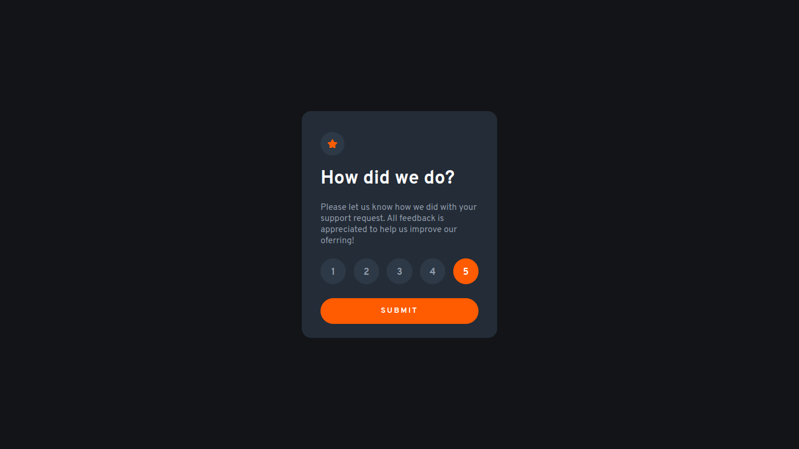
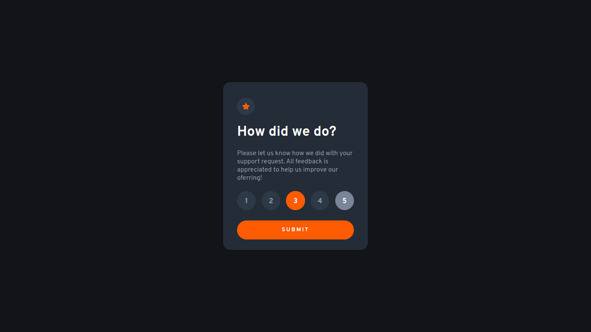
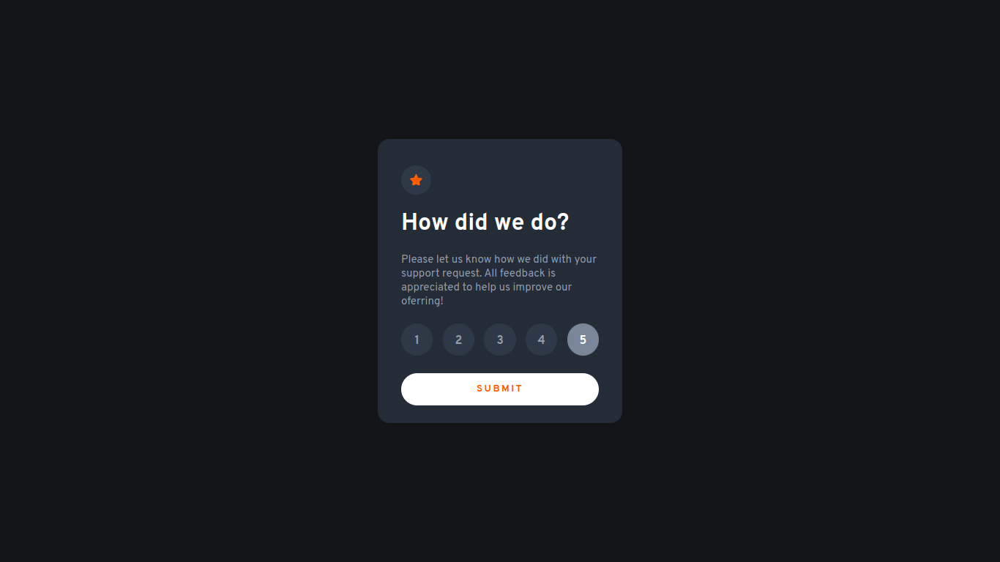
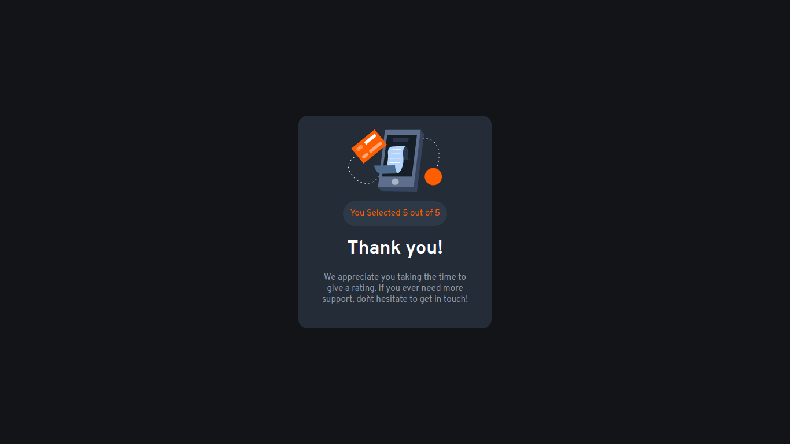

# Frontend Mentor - Interactive rating component solution

This is a solution to the [Interactive rating component challenge on Frontend Mentor](https://www.frontendmentor.io/challenges/interactive-rating-component-koxpeBUmI). Frontend Mentor challenges help you improve your coding skills by building realistic projects. 

## Table of contents

- [Overview](#overview)
  - [The challenge](#the-challenge)
  - [Screenshot](#screenshot)
  - [Links](#links)
- [My process](#my-process)
  - [Built with](#built-with)
  - [What I learned](#what-i-learned)
  - [Continued development](#continued-development)
  - [Useful resources](#useful-resources)
- [Author](#author)
- [Acknowledgments](#acknowledgments)

## Overview

### The challenge

Users should be able to:

- View the optimal layout for the app depending on their device's screen size
- See hover states for all interactive elements on the page
- Select and submit a number rating
- See the "Thank you" card state after submitting a rating

### Screenshot
<div align="center">






</div>

### Links

- Solution URL: [GitHubRepo](https://github.com/guihtryb/project-00-interactive-rating)
- Live Site URL: [LiveSite](https://guihtryb.github.io/project-00-interactive-rating/)

## My process

### Built with

- Semantic HTML5 markup
- CSS custom properties
- Flexbox
- Mobile-first workflow
- [React](https://reactjs.org/) - JS library

### What I learned

- Application state management with React Context API.
- Develop a highly componentized application.

```jsx
  const [loading, setLoading] = React.useState(false);

  const { setRated } = React.useContext(Context);

  const ratingParagraphContent = 'Please let us know how we did with your support request. All feedback is appreciated to help us improve our oferring!';

  const handleSubmit = (e) => {
    e.preventDefault();
    setLoading(true);
    setTimeout(() => {
      try {
        setRated(true);
      } catch (error) {
        alert('Something went wrong! Try again in a few minutes.');
        setRated(false);
      } finally {
        setLoading(false);
      }
    }, 200);
  };

  if (loading) return (<Loading />);

  return (
    <div className="card-container">
      <Decoration isRatingCard />
      <Title title="How did we do?" isRatingCard />
      <Paragraph content={ratingParagraphContent} isRatingCard />
      <Form handleSubmit={handleSubmit} />
    </div>
  );
```

## Author

- Website - [GuilhermeViana](https://guihtryb.github.io/)
- Frontend Mentor - [@guihtryb](https://www.frontendmentor.io/profile/guihtryb)

